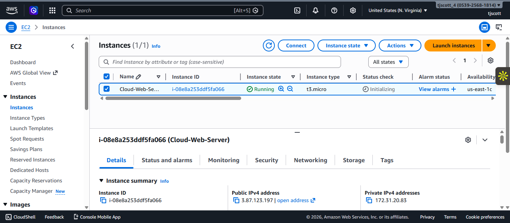
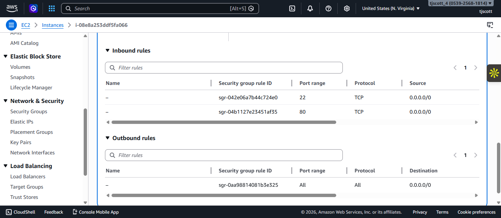
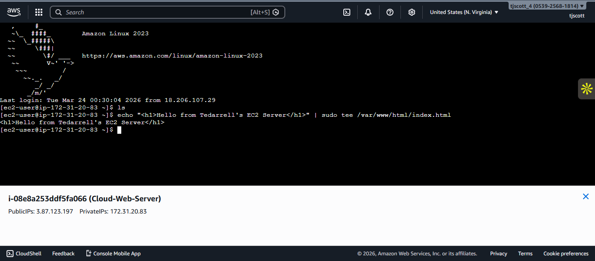
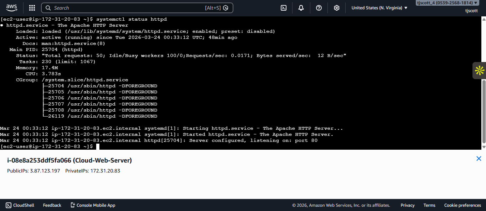
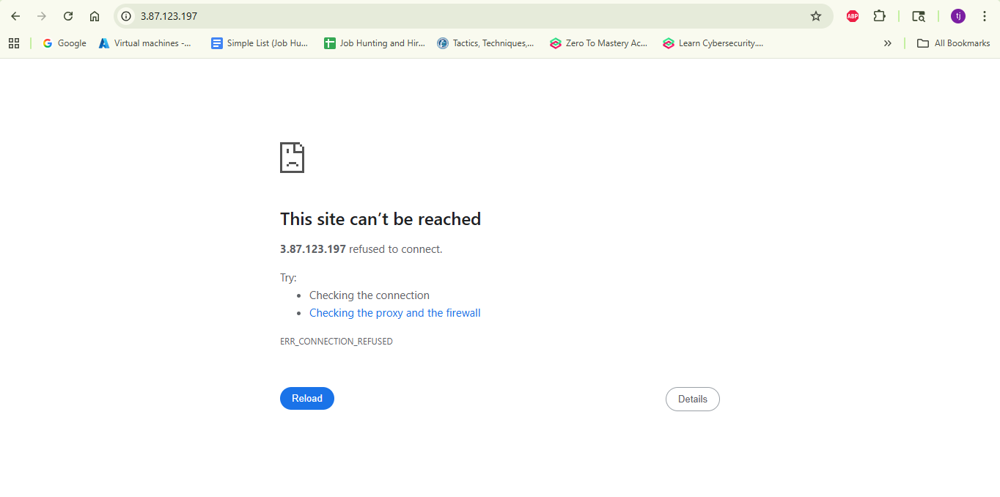
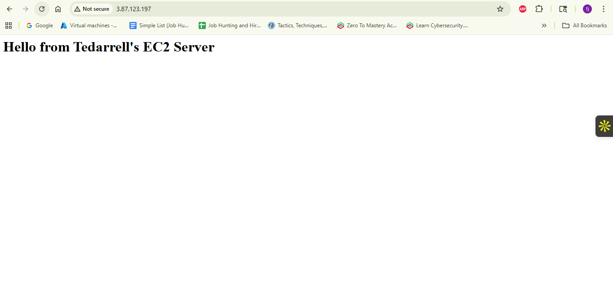

# AWS EC2 Web Server Project (Apache + Troubleshooting)

## Overview

This project demonstrates how to deploy a web server using **Amazon EC2**, configure network access, and troubleshoot a real-world service outage.

The project includes launching an EC2 instance, installing Apache, hosting a website, and simulating a failure scenario by stopping the web server.

---

## AWS Services Used

* Amazon EC2
* Security Groups (Firewall)
* Amazon Linux 2023

---

## Project Architecture

User Browser
⬇
Public IP Address
⬇
EC2 Instance (Linux)
⬇
Apache Web Server

---

## 1. Launch EC2 Instance

A Linux-based EC2 instance was launched using Amazon Linux 2023.

---

## 2. Configure Security Group

Inbound rules were configured to allow:

* SSH (Port 22)
* HTTP (Port 80)

---

## 3. Connect to EC2 Instance

Connected to the EC2 instance using EC2 Instance Connect and executed Linux commands.

---

## 4. Install and Start Apache

Installed Apache (httpd) and verified that the service was running.

---

## 5. Deploy Website

Created an `index.html` file and verified the website was accessible via the public IP address.

---

## 6. Simulate Failure (Website Down)

Stopped the Apache service to simulate a real-world outage.

This caused the website to become unreachable.

---

## 7. Restore Service (Website Fixed)

Restarted the Apache service to restore website functionality.

---

## Key Skills Demonstrated

* EC2 instance deployment and configuration
* Linux command-line usage
* Apache web server installation and management
* Security group (firewall) configuration
* Troubleshooting service outages
* Diagnosing connection issues
* Restoring application availability

---

## Website Access

http://3.87.123.197

---

## Author

**Tedarrell Scott Jr**
Aspiring Cloud Support / Cloud Operations Engineer
